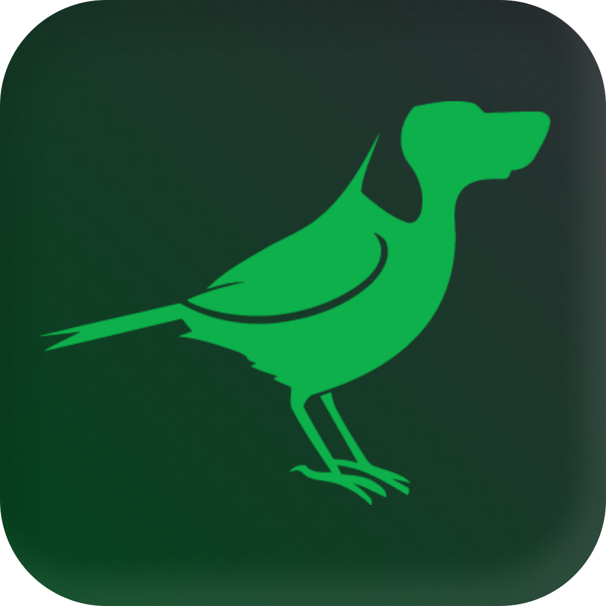

  

# BirdDog NDI - Home Assistant Integration

A custom Home Assistant integration to monitor and control **BirdDog NDI** devices over your local network:
- **BirdDog PLAY & PLAY PRO**
- **BirdDog MINI** (HDMI $\leftrightarrow$ NDI Encoder/Decoder)
- **BirdDog FLEX 4K** (Flex 4K IN, Flex 4K OUT, Flex 4K Backpack)
- **BirdDog STUDIO**

---

## What's New in v1.3.9

- 📡 **Real-Time Hardware Source Status & Telemetry via WebSocket (Port 6790)**: Integrated native telemetry querying against BirdDog's WebSocket server on port 6790 (`ws://<host>:6790`), capturing live source status (`src_stat`), video resolution (`vid_res`), framerate (`vid_fr`), and network bandwidth.
- 🎯 **Accurate "Decoding Active" Detection**: Fixed `binary_sensor.<name>_decoding_active` which previously reported `Running` whenever a source was selected in settings, regardless of actual stream state. The sensor now accurately reflects live decoding: it reports `Not running` when the decoder is in `Initializing`, `No Signal`, or `Disconnected` state (0x0 resolution), and `Running` only when a valid stream is actively rendering.
- 🏷️ **New "Source Status" Sensor (`sensor.<name>_source_status`)**: Added a dedicated sensor matching the BirdDog web admin status header (`Initializing`, `Connected`, `Online`, `No Source`), with rich attributes for active video resolution, framerate, and network bitrate.
- 🔄 **Comprehensive Source Resolution Fallback**: Fixed `NDI Foyer` and `NDI Fell. Hall` displaying `No Source` by falling back to live WebSocket stream names (`vid_str_name`) and `/about` Format headers when `/connectTo` returns empty payloads.
- ⚡ **Dual-Path Source Switching (`/connectTo` & `/videoset`)**: `set_source()` now submits stream switching commands simultaneously across the REST API (`/connectTo`) and BirdDog web portal form submission (`/videoset`), ensuring instant switching across all firmware revisions.

---

## What's New in v1.3.8

- 🛑 **Eliminated Stream Reverts & Decoder Dropouts**: Removed automatic `/refresh` discovery scans from routine 15-second coordinator polling. Calling `/refresh` was triggering active mDNS network discovery scans on BirdDog decoders, disrupting active NDI video decoding and causing selected video sources to revert back to default streams.
- ⚡ **Optimistic Video Source Switching & Settling Delay**: `select.py` now updates state optimistically and provides a 2-second settling window before polling the hardware, preventing rapid race conditions where immediate queries returned the old stream name before the decoder finished switching.
- 🛡️ **Robust Coordinator Error Handling**: Wrapped `BirdDogAPIError` and unexpected exceptions in `UpdateFailed` so transient HTTP errors or 404s on optional endpoints do not crash the polling cycle or freeze sensor telemetry.
- 🌐 **Bidirectional Port Adaptation**: Added automatic fallback and migration between port 8080 (REST API) and port 80 (Web UI / BirdUI) in both directions during connection checks, config flow, and integration startup.
- 🗺️ **Subnet-Aware NDI Stream Routing**: Automatically maps stream names to IP:port pairings from `/list` and includes `connectToIp` and `port` in `/connectTo` payloads for cross-subnet switching.
- 🔇 **Audio Endpoint Caching**: Dynamically caches working audio endpoints to eliminate repeated 404 requests during polling cycles.

---

## What's New in v1.3.7

- 🛠️ **Dedicated Session & Numerical IP Cookie Jar Isolation**: Switched client architecture to dedicated sessions using `aiohttp.CookieJar(unsafe=True)`, ensuring session cookies for raw numerical IP addresses are never dropped by strict client policies.
- 🔄 **Automatic Port 80-to-8080 Runtime Migration & Polling Auto-Correction**: Existing and newly added config entries configured on port 80 are automatically probed for port 8080 REST API availability and migrated seamlessly in both coordinator polling and integration startup.
- 🎯 **Accurate Network Error Classification**: Unreachable devices or network timeouts now correctly trigger connection errors (`cannot_connect`) rather than misleading authentication failure prompts (`invalid_auth`).
- 🔐 **Header-Injected Token Persistence**: All REST and auth probe requests explicitly attach `BirdDogSession` cookies in request headers for persistent session recognition across firmware versions.

---

## What's New in v1.3.6

- 🍪 **aiohttp Dual `Set-Cookie` Collision Fix**: Resolved session loss where devices emit both `BirdDogSession=; Max-Age=0` and `BirdDogSession=<token>`, manually parsing headers with `allow_redirects=False` and capturing 302 redirects.

---

## What's New in v1.3.5

- 🧩 **Discovery Flow Context Host Fallback**: Retains and restores discovered host and port context across config flow interruptions and page reloads.

---

## What's New in v1.3.4

- ⚡ **BirdDog Mini Support & Auto Port 8080 Redirection**: Automatically redirects web UI port 80 to the unauthenticated REST API on port 8080 for BirdDog Mini devices.
- 📋 **Dictionary Key NDI Source Extraction**: Expanded source discovery to parse dictionary key-value mappings returned by `/list`.

---

## What's New in v1.3.3

- 🔍 **Multi-Vector Zeroconf De-Duplication**: Prevents duplicate discovery cards by correlating IPv4, IPv6 link-local addresses, hardware MAC suffixes, and active in-progress flows.

---

## What's New in v1.3.2

## What's New in v1.3.0

- 🌐 **Expanded Device Support**: Comprehensive support for **BirdDog MINI**, **FLEX 4K**, **PLAY**, **PLAY PRO**, and **STUDIO**.
- 🔓 **Adaptive Authentication**:
  - Automatically identifies open REST APIs on devices like the **BirdDog Mini** and **Flex 4K** that don't require web session logins.
  - Seamlessly applies session-cookie login for password-protected web interfaces like **BirdDog Play**.
  - Strict pre-validation: rejects incorrect passwords on protected devices before adding.
- 🔄 **Operation Mode Telemetry**: Added `sensor.<name>_operation_mode` to monitor whether dual-mode converters like the **Mini** and **Flex** are in **Decode** or **Encode** mode (`/operationmode`).

---

## Installation via HACS

1. Make sure [HACS](https://hacs.xyz) is installed in your Home Assistant.
2. In Home Assistant, open **HACS** $\rightarrow$ Click the **three dots** in the top right $\rightarrow$ Select **Custom repositories**.
3. Add the repository:
   - **Repository**: `https://github.com/mtcdtech/ha-birddog-ndi`
   - **Category**: `Integration`
4. Click **Add**, find **BirdDog NDI** in HACS, and click **Download** (`v1.3.0`).
5. Restart Home Assistant.

---

## Configuration

### Automatic Discovery (mDNS / Zeroconf)
When any BirdDog device is detected on your local network, Home Assistant will prompt:
> **"Discovered BirdDog Device"**

Click **Configure**, enter your password if required (or leave default `birddog`), and submit!

### Manual Setup
1. In Home Assistant, go to **Settings $\rightarrow$ Devices & Services $\rightarrow$ Add Integration**.
2. Search for **BirdDog NDI**.
3. Enter:
   - **Host or IP Address** (e.g. `192.168.1.120`)
   - **Port** (Default `8080`, fallback `80`)
   - **Password** (Default `birddog`, automatically skipped on open REST devices like Mini/Flex)
   - **Device Name** (Optional friendly name)

### Changing Settings
On an already added device, go to **Settings $\rightarrow$ Devices & Services $\rightarrow$ BirdDog NDI $\rightarrow$ Configure**. You can update the password or adjust the update interval (5–60s) directly.

---

## Entities Provided

| Platform | Entity | Description |
| :--- | :--- | :--- |
| `sensor` | `sensor.<name>_status` | Connection state (`Online` / `Offline`) |
| `sensor` | `sensor.<name>_current_source` | Currently active NDI source name |
| `sensor` | `sensor.<name>_operation_mode` | Active mode (`Decode` or `Encode`) for Mini/Flex |
| `sensor` | `sensor.<name>_ip_address` | Device IP address (attributes: `netmask`, `gateway`) |
| `sensor` | `sensor.<name>_mac_address` | Hardware MAC address |
| `sensor` | `sensor.<name>_network_mode` | Network configuration (`DHCP` or `Static`) |
| `sensor` | `sensor.<name>_firmware` | Firmware version |
| `sensor` | `sensor.<name>_model` | Detected hardware model (`MINI`, `FLEX 4K`, `PLAY`, `PLAY PRO`, `STUDIO`) |
| `binary_sensor` | `binary_sensor.<name>_decoding_active` | `on` when actively decoding a stream |
| `select` | `select.<name>_video_source` | Dropdown to switch active NDI stream |
| `switch` | `switch.<name>_audio_mute` | Toggle audio mute |
| `button` | `button.<name>_reboot` | Trigger hardware reboot |
| `button` | `button.<name>_restart_video` | Restart video engine |
| `button` | `button.<name>_refresh_sources` | Trigger NDI discovery scan |

---

## License

MIT License. Developed by MTCD Tech.
